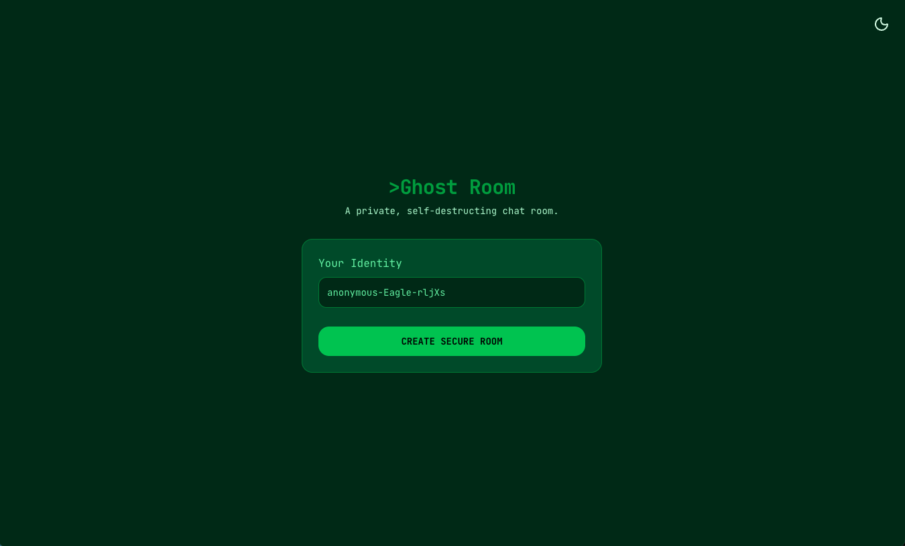
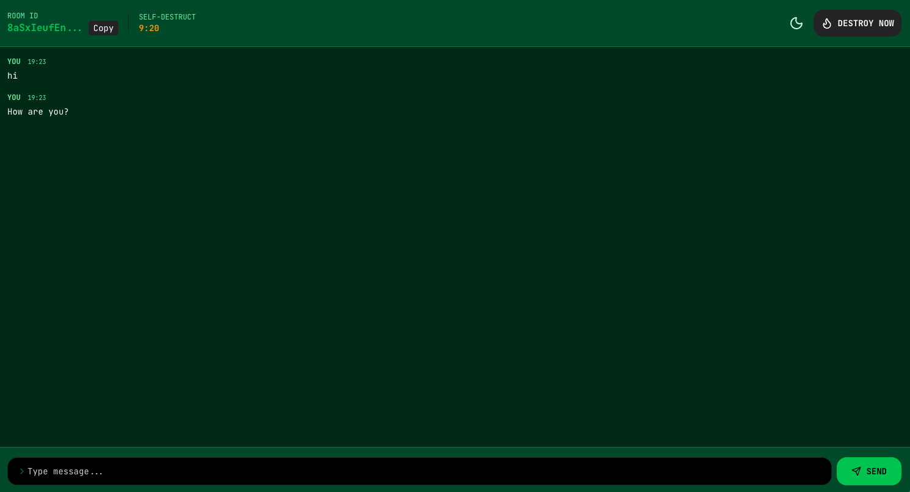

# GhostChat 👻





## Overview

GhostChat is a modern, ephemeral messaging application designed for privacy and speed. Create a room, share the link, and chat in real-time. Messages are self-destructing, ensuring your conversations remain private and transient. Built with Next.js, TypeScript, Redis, and Tailwind for fast, ephemeral communication.

## Features

- **🔒 Private Rooms**: Generate unique, secure room links instantly.
- **⚡ Real-time Communication**: Instant message delivery powered by Upstash Redis & Realtime.
- **💣 Self-destructing Messages**: Messages are ephemeral and don't persist forever.
- **🎨 Modern UI**: Sleek, responsive design built with Tailwind CSS v4 and Next.js 16.
- **👻 Interactive Elements**: Dynamic 3D elements powered by Three.js.
- **🌙 Dark Mode**: Built-in support for dark/light themes.

## Tech Stack

- **Framework**: [Next.js 16](https://nextjs.org/) (App Router)
- **Runtime**: [Bun](https://bun.sh/)
- **Backend/API**: [ElysiaJS](https://elysiajs.com/)
- **Database/Realtime**: [Upstash Redis](https://upstash.com/)
- **Styling**: [Tailwind CSS v4](https://tailwindcss.com/)
- **Icons**: [Lucide React](https://lucide.dev/)
- **Validation**: [Zod](https://zod.dev/)
- **State Management**: [TanStack Query](https://tanstack.com/query/latest)

## Getting Started

### Prerequisites

- [Bun](https://bun.sh/) runtime installed.
- An [Upstash](https://upstash.com/) account for Redis and Realtime.

### Installation

1.  **Clone the repository**:

    ```bash
    git clone https://github.com/faridvatani/ghostchat.git
    cd ghostchat
    ```

2.  **Install dependencies**:

    ```bash
    bun install
    ```

3.  **Environment Setup**:
    Copy the example environment file and configure your keys.

    ```bash
    cp .env.example .env
    ```

    Open `.env` and add your Upstash Redis credentials and other necessary secrets.

4.  **Run the development server**:

    ```bash
    bun run dev
    ```

    Open [http://localhost:3000](http://localhost:3000) with your browser to start chatting.

## Contributing

Contributions are welcome! Please feel free to submit a Pull Request.

## License

This project is licensed under the MIT License - see the [LICENSE](LICENSE) file for details.
